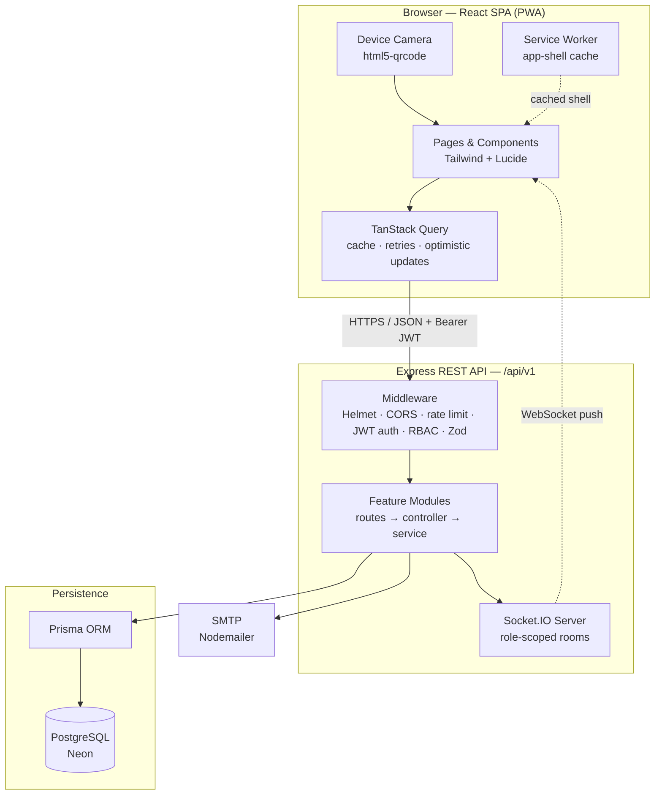
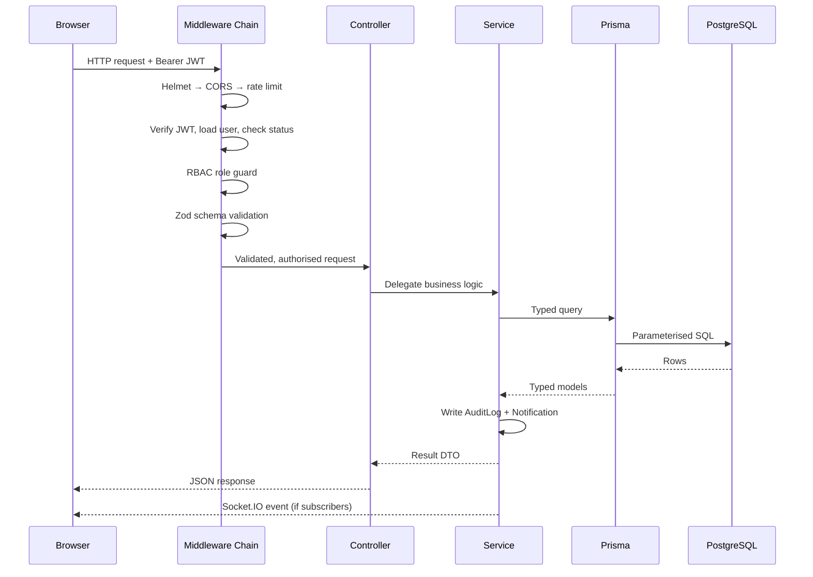
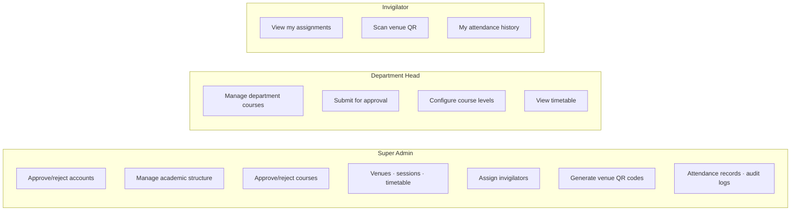
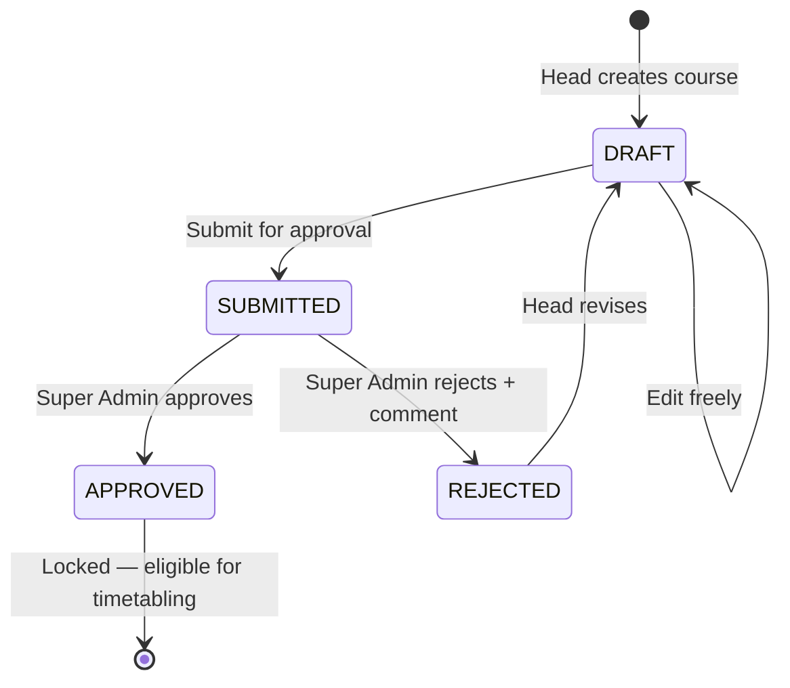
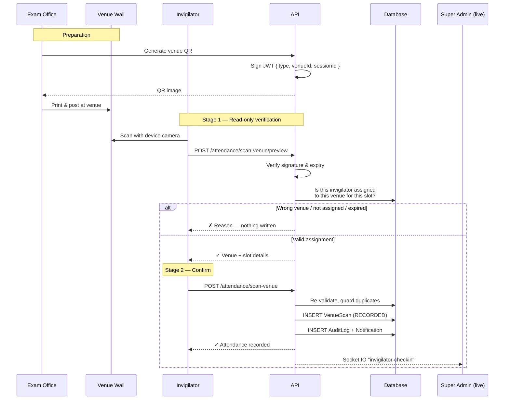
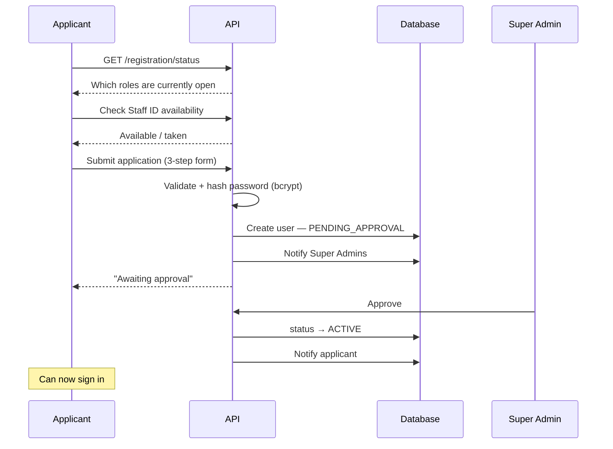
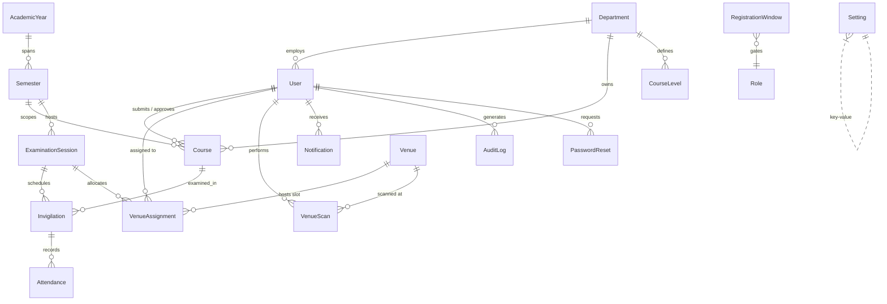
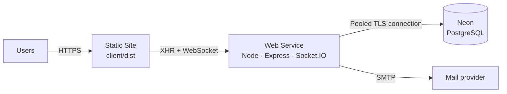

# Examination Timetabling & Invigilator Verification System

A full-stack, role-based platform that digitises the entire university examination lifecycle — from course submission and approval, through timetable planning and venue allocation, to **QR-code-based invigilator attendance verification** with live real-time notifications.

Built for the University of Energy and Natural Resources (UENR) Examination Office.

<p align="center">
  
</p>

<p align="center">
  
  
  
  
  
  
  
  
</p>

---

## Table of Contents

- [Demo Login Credentials](#demo-login-credentials)
- [Why This Project](#why-this-project)
- [Feature Highlights](#feature-highlights)
- [Tech Stack](#tech-stack)
- [System Architecture](#system-architecture)
- [Role-Based Access Model](#role-based-access-model)
- [Core Workflows](#core-workflows)
  - [Course Approval Flow](#course-approval-flow)
  - [QR Attendance Verification Flow](#qr-attendance-verification-flow)
  - [Account Registration & Approval Flow](#account-registration--approval-flow)
- [Data Model](#data-model)
- [Repository Layout](#repository-layout)
- [API Surface](#api-surface)
- [Getting Started](#getting-started)
- [Configuration](#configuration)
- [Security Practices](#security-practices)
- [Progressive Web App](#progressive-web-app)
- [Deployment](#deployment)
- [Engineering Highlights](#engineering-highlights)
- [Roadmap](#roadmap)

---

## Demo Login Credentials

The system is live at **[https://unertimetable.vercel.app](https://unertimetable.vercel.app)**.

Use either of the Super Admin accounts below to explore all features:

| Account | Email | Password |
| --- | --- | --- |
| **Primary Super Admin** | `yeboahmichael977@gmail.com` | `!@Firatata45` |
| **Demo Super Admin** | `demoadmin@uenr.edu.gh` | `Demo@2026` |

Both accounts have full Super Admin privileges — manage departments, approve courses, create exam sessions, generate QR codes, assign invigilators, and view attendance records.

---

## Why This Project

Examination administration at scale involves a lot of coordination that is traditionally handled on paper and spreadsheets: collecting course lists from every department, approving them, allocating venues, assigning invigilators to time slots, and — the hardest part — **proving that an invigilator actually showed up at the right venue at the right time**.

This system solves that end-to-end:

| Problem | Solution in this system |
| --- | --- |
| Course lists arrive by email in inconsistent formats | Structured submission per department/level/semester with validation |
| No audit trail on approvals | Every action written to an immutable `AuditLog` |
| Invigilator no-shows are discovered too late | Live Socket.IO check-in feed for the Examination Office |
| Attendance sheets can be forged or signed remotely | Signed, expiring QR codes physically posted at each venue |
| Invigilators scan the wrong venue's code | Two-stage scan: server validates assignment *before* recording anything |
| Staff forget the web address | Installable PWA shortcut on desktop/mobile |

---

## Feature Highlights

### Authentication & Access
- JWT authentication with a **single unified login** for all three roles.
- Self-registration gated by **time-boxed registration windows** per role, configurable by the Super Admin.
- Accounts land in `PENDING_APPROVAL` and require explicit Super Admin approval before sign-in.
- Staff-ID uniqueness checked live during registration (before submit).
- Password reset via emailed, single-use, expiring token.
- Strong-password policy enforced on both client and server with a live requirement checklist.

### Academic Structure
- Departments → Academic Years → Semesters, fully CRUD-managed.
- Per-department configurable course levels.
- Skeleton-loader UX on every structure page for perceived performance.

### Courses & Approvals
- Department Heads draft and submit courses; Super Admin approves or rejects with a comment.
- Courses lock after approval to prevent post-approval tampering.
- Bulk review queue with per-item feedback.

### Examinations, Venues & Timetable
- Examination sessions scoped to a semester with publish gating.
- Venue registry with capacity and active/inactive state.
- Timetable planning view with conflict-aware slot allocation.
- Venue-level invigilator assignment per date/slot.

### QR Attendance Verification
- Per-venue signed QR codes generated by the Examination Office, printable in bulk or individually.
- Invigilators scan with the device camera directly in the browser — no native app required.
- **Two-stage verification**: a read-only preview endpoint validates the venue assignment and returns immediate feedback ("you are at the wrong venue") *before* anything is written; attendance is only recorded after explicit confirmation.
- Duplicate-scan, unassigned-invigilator, venue-mismatch, and expired-window rejections are all distinct, logged outcomes.
- Live check-in feed broadcast to Super Admins over Socket.IO.

### Platform
- Real-time in-app notifications with unread badges.
- Immutable audit log of every privileged action.
- Excel export of attendance and course data.
- Installable Progressive Web App with offline shell caching.

---

## Tech Stack

**Frontend**
React 18 · Vite 5 · React Router 6 · TailwindCSS 3 · TanStack Query 5 · React Hook Form · Zod · Axios · Socket.IO Client · `html5-qrcode` · `qrcode` · SheetJS · Lucide · Framer Motion

**Backend**
Node.js 20 · Express 4 · Prisma ORM 5 · PostgreSQL · JSON Web Tokens · bcryptjs · Zod · Helmet · CORS · `express-rate-limit` · compression · Nodemailer · Socket.IO

**Infrastructure**
Render (API web service + static site) · Neon serverless PostgreSQL · Prisma Migrate

---

## System Architecture



### Request Lifecycle



The backend follows a strict **routes → controller → service → Prisma** layering. Controllers stay thin (HTTP concerns only); all business rules live in services, which makes them independently testable and reusable across HTTP and socket entry points.

---

## Role-Based Access Model



| Capability | Super Admin | Department Head | Invigilator |
| --- | :---: | :---: | :---: |
| Self-register | ✗ (seed only) | ✓ (window) | ✓ (window) |
| Approve accounts | ✓ | ✗ | ✗ |
| Departments / years / semesters | ✓ | ✗ | ✗ |
| Create & submit courses | ✗ | ✓ (own dept) | ✗ |
| Approve / reject courses | ✓ | ✗ | ✗ |
| Venues, sessions, timetable | ✓ | view | ✗ |
| Assign invigilators | ✓ | ✗ | ✗ |
| Generate venue QR codes | ✓ | ✗ | ✗ |
| Scan attendance QR | ✗ | ✗ | ✓ |
| All attendance records | ✓ | ✗ | own only |
| Audit logs | ✓ | ✗ | ✗ |

Authorisation is enforced server-side on every route via a role guard, and mirrored client-side by a `ProtectedRoute` wrapper so unauthorised navigation never renders.

---

## Core Workflows

### Course Approval Flow



Once `APPROVED`, the course is flagged `locked` and becomes immutable to the Department Head, guaranteeing that what was approved is exactly what gets timetabled.

### QR Attendance Verification Flow

This is the heart of the system. The key design decision is that **scanning is non-destructive until confirmed** — the invigilator gets accurate feedback about whether they are in the right place before any record exists.



Every rejection path is persisted as a typed outcome, giving the Examination Office a complete forensic picture:

| Outcome | Meaning |
| --- | --- |
| `RECORDED` | Valid check-in, attendance stored |
| `REJECTED_VENUE_MISMATCH` | Invigilator scanned a venue they are not assigned to |
| `REJECTED_UNASSIGNED` | No assignment exists for this user in this session |
| `REJECTED_DUPLICATE` | Already checked in for this venue and slot |
| `REJECTED_WINDOW` | Scan fell outside the permitted time window |
| `REJECTED_INVALID_QR` | Signature invalid, malformed, or expired token |

**Anti-fraud properties**

- QR payloads are **cryptographically signed** — a hand-crafted or edited code fails verification.
- Tokens **expire**, so a photographed code has a short useful life.
- Codes are **venue-bound**, not user-bound — scanning another venue's code is detected and rejected.
- The server, never the client, decides assignment validity.
- IP address and user agent are captured alongside every scan.

### Account Registration & Approval Flow



Login is blocked for any account not in `ACTIVE` status, so approval is a genuine gate rather than a cosmetic flag.

---

## Data Model



**Model groups**

| Group | Models |
| --- | --- |
| Identity & access | `User`, `RegistrationWindow`, `PasswordReset` |
| Academic structure | `Department`, `AcademicYear`, `Semester`, `CourseLevel` |
| Curriculum | `Course` |
| Examinations | `ExaminationSession`, `Venue`, `Invigilation` |
| Attendance | `VenueAssignment`, `VenueScan`, `Attendance` |
| Platform | `AuditLog`, `Notification`, `Setting` |

**Enums** — `Role`, `UserStatus`, `CourseStatus`, `AttendanceResult`.

Referential integrity is deliberate: `onDelete: Restrict` protects records that are referenced by examination history, `Cascade` is used for owned children, and `SetNull` preserves historical rows (e.g. an audit entry survives the deletion of its actor). Composite indexes back every hot query path — `[invigilatorId, slotAt]`, `[examinationSessionId, venueId]`, `[userId, isRead, createdAt]`, and others.

---

## Repository Layout

```
Time_Table_Web_App/
├── client/                          # React + Vite SPA (PWA)
│   ├── public/
│   │   ├── assets/images/           # Logo, login backdrop
│   │   ├── manifest.json            # PWA manifest
│   │   └── sw.js                    # Service worker — app-shell cache
│   └── src/
│       ├── components/              # Reusable UI
│       │   ├── EntityPage.jsx       # Generic CRUD page w/ skeleton loaders
│       │   ├── InstallPrompt.jsx    # One-time PWA install prompt
│       │   └── ui/                  # Modal, PageHeader, EmptyState, ConfirmDialog…
│       ├── context/AuthContext.jsx  # Session state + 401 interception
│       ├── features/                # Per-domain API clients & widgets
│       ├── layouts/                 # AuthLayout, DashboardLayout
│       ├── lib/                     # axios instance, queryClient, helpers
│       ├── pages/                   # Route screens by domain
│       │   ├── auth/                # Login, Register, Reset password
│       │   ├── academic/ courses/ examinations/
│       │   ├── attendance/          # Scan, QR codes, records, history
│       │   ├── timetable/ venues/ users/ notifications/
│       └── routes/                  # AppRoutes, ProtectedRoute
│
└── server/                          # Express + Prisma API
    ├── prisma/
    │   ├── schema.prisma            # Single source of truth for the DB
    │   ├── migrations/              # Version-controlled schema history
    │   └── seed.js                  # Super Admin bootstrap
    └── src/
        ├── app.js                   # Express app assembly
        ├── index.js                 # HTTP server + Socket.IO + shutdown
        ├── config/env.js            # Zod-validated environment config
        ├── middleware/              # auth, RBAC, validate, rateLimit, errors
        ├── modules/                 # Feature modules (routes/controller/service)
        │   ├── auth/ registration/ users/
        │   ├── departments/ academicYears/ semesters/
        │   ├── courses/ courseLevels/
        │   ├── examinationSessions/ venues/ venueAssignments/
        │   ├── invigilations/ timetable/ attendance/
        │   └── dashboard/ notifications/
        ├── routes/index.js          # Mounts all modules under /api/v1
        └── utils/                   # prisma, jwt, qr, socket, mailer, logger
```

Each feature module is self-contained and follows the same shape, so adding a domain is mechanical:

```
modules/<feature>/
├── <feature>.routes.js       # HTTP verbs + middleware wiring
├── <feature>.controller.js   # Request/response translation
├── <feature>.service.js      # Business rules + Prisma access
└── <feature>.schema.js       # Zod request validation
```

---

## API Surface

All endpoints are namespaced under `/api/v1`. Authenticated routes expect an `Authorization: Bearer <token>` header.

| Area | Representative endpoints |
| --- | --- |
| Auth | `POST /auth/login` · `POST /auth/logout` · `GET /auth/me` · `POST /auth/forgot-password` · `POST /auth/reset-password` |
| Registration | `GET /registration/status` · `GET /registration/check-staff-id` · `POST /registration` |
| Users | `GET /users` · `POST /users/:id/approve` · `POST /users/:id/reject` · `GET /users/pending` |
| Registration windows | `GET /registration-windows` · `PUT /registration-windows/:role` |
| Academic | `GET|POST|PATCH|DELETE /departments` · `/academic-years` · `/semesters` |
| Courses | `GET|POST|PATCH|DELETE /courses` · `POST /courses/:id/submit` · `POST /courses/:id/approve` · `POST /courses/:id/reject` |
| Course levels | `GET|POST|DELETE /course-levels` |
| Venues | `GET|POST|PATCH|DELETE /venues` |
| Sessions | `GET|POST|PATCH /examination-sessions` |
| Timetable | `GET /timetable` · `POST /timetable/allocate` |
| Assignments | `GET|POST|DELETE /venue-assignments` · `GET /invigilations/mine` |
| Attendance | `POST /attendance/scan-venue/preview` · `POST /attendance/scan-venue` · `POST /attendance/scan` · `GET /attendance` · `GET /attendance/mine` · `GET /attendance/venue-qr` |
| Notifications | `GET /notifications` · `POST /notifications/:id/read` · `POST /notifications/read-all` |
| Dashboard | `GET /dashboard/stats` |

Real-time events are emitted to role-scoped Socket.IO rooms — for example `invigilator-checkin` to Super Admins, and per-user notification pushes.

---

## Getting Started

### Prerequisites

- Node.js 20.x (the project pins `>=20 <23`)
- A PostgreSQL 14+ database (a free [Neon](https://neon.tech) project works well)
- npm 10+

### 1. Clone

```bash
git clone https://github.com/ymikenzy55/Time_tabling_and_Invigilator_verification_System.git
cd Time_tabling_and_Invigilator_verification_System
```

### 2. Backend

```bash
cd server
npm install
cp .env.example .env        # Windows: copy .env.example .env
```

Fill in your own values in `server/.env` (see [Configuration](#configuration)), then:

```bash
npx prisma generate
npx prisma migrate dev
npm run seed                # Creates the initial Super Admin
npm run dev                 # http://localhost:4000
```

### 3. Frontend

```bash
cd ../client
npm install
cp .env.example .env        # Windows: copy .env.example .env
npm run dev                 # http://localhost:5173
```

Sign in with the Super Admin credentials you supplied to the seed script, then open the registration windows so Department Heads and Invigilators can apply.

### Useful Scripts

| Location | Command | Purpose |
| --- | --- | --- |
| `server` | `npm run dev` | API with hot reload (nodemon) |
| `server` | `npm start` | Production API |
| `server` | `npm run seed` | Bootstrap the Super Admin |
| `server` | `npm run prisma:migrate` | Create & apply a dev migration |
| `server` | `npm run deploy:migrate` | Apply migrations in production |
| `server` | `npm run prisma:studio` | Browse data in Prisma Studio |
| `client` | `npm run dev` | Vite dev server |
| `client` | `npm run build` | Production bundle to `dist/` |
| `client` | `npm run preview` | Serve the built bundle locally |
| `client` | `npm run lint` | ESLint |

---

## Configuration

> **No secrets are committed to this repository.** Every value below is supplied through environment variables — locally via untracked `.env` files, and in production via your host's secret manager. `.env.example` files document the shape only, never real values.

### Server (`server/.env`)

| Variable | Required | Description |
| --- | :---: | --- |
| `DATABASE_URL` | ✓ | PostgreSQL connection string (use the pooled URL on Neon) |
| `JWT_SECRET` | ✓ | Signing key for auth tokens — minimum 16 chars, high entropy |
| `CLIENT_ORIGIN` | ✓ | Comma-separated list of allowed frontend origins, full URLs |
| `NODE_ENV` | — | `development` \| `test` \| `production` (default `development`) |
| `PORT` | — | API port (default `4000`) |
| `JWT_EXPIRES_IN` | — | Token lifetime (default `1d`) |
| `BCRYPT_ROUNDS` | — | Password hashing cost, 8–15 (default `10`) |
| `QR_SIGNING_SECRET` | — | Dedicated key for signing QR payloads; falls back to `JWT_SECRET` |
| `SUPER_ADMIN_EMAIL` | — | Seed-only: initial Super Admin email |
| `SUPER_ADMIN_PASSWORD` | — | Seed-only: initial Super Admin password |
| `SUPER_ADMIN_NAME` | — | Seed-only: display name |
| `SUPER_ADMIN_STAFF_ID` | — | Seed-only: staff identifier |
| `SMTP_HOST` | — | Mail host for password-reset emails |
| `SMTP_PORT` | — | Mail port (default `587`) |
| `SMTP_USER` | — | SMTP username |
| `SMTP_PASS` | — | SMTP password or app password |
| `SMTP_FROM` | — | From address on outgoing mail |

Configuration is parsed and validated by Zod at boot in `server/src/config/env.js`. **If a required variable is missing or malformed the process exits immediately with a readable error** — the app never starts in a half-configured state.

### Client (`client/.env`)

| Variable | Required | Description |
| --- | :---: | --- |
| `VITE_API_BASE_URL` | ✓ | Base URL of the API, e.g. `http://localhost:4000/api/v1` |

> Vite inlines `VITE_*` variables into the public bundle at build time. Never place a secret in a `VITE_`-prefixed variable.

### Third-Party Credentials

There are **no external OAuth clients, payment keys, or paid API keys** anywhere in this project. QR generation and scanning are fully self-hosted — codes are signed with your own secret and decoded in-browser via the device camera. The only optional external dependency is an SMTP provider for password-reset email.

---

## Security Practices

| Layer | Measure |
| --- | --- |
| Transport | HTTPS in production; `trust proxy` set for correct client IPs behind a load balancer |
| Headers | Helmet applies a hardened default header set; `x-powered-by` disabled |
| CORS | Strict allow-list parsed from `CLIENT_ORIGIN`; credentials enabled |
| Rate limiting | Global limiter plus tighter limits on auth endpoints to blunt brute force |
| Passwords | bcrypt with configurable cost; strength policy enforced server-side, not just in the UI |
| Tokens | Short-lived signed JWTs; 401 responses are intercepted app-wide to clear stale sessions instantly |
| Authorisation | Role guards on every protected route — the client-side guard is UX, not security |
| Input validation | Zod schemas validate and coerce every request body, query, and param |
| SQL injection | Eliminated by Prisma's parameterised queries; no string-built SQL |
| QR integrity | Signed, expiring, venue-bound payloads validated exclusively server-side |
| Account lifecycle | `PENDING_APPROVAL` gate; login refused for non-`ACTIVE` accounts |
| Password reset | Single-use, time-limited tokens stored hashed and marked `used` on redemption |
| Auditability | Immutable `AuditLog` capturing actor, action, target, result, IP, and user agent |
| Secret hygiene | No credentials in source control; `.env` files gitignored; boot-time validation |

---

## Progressive Web App

The client is an installable PWA, so staff can launch it from the desktop or home screen like a native app while it stays a single deployed web app.

- `manifest.json` declares name, icons, theme colour, and `standalone` display.
- `sw.js` caches the app shell with a network-first strategy for navigations and cache-first for static assets, with SPA fallback to `index.html`.
- `InstallPrompt.jsx` captures the browser's `beforeinstallprompt` event and surfaces a branded modal shortly after sign-in.
- The prompt is shown **once per user account** — the decision is recorded in `localStorage` under a per-user key, so nobody is nagged on every visit.
- Declining costs nothing; the app remains fully functional in a normal browser tab.

---

## Deployment

The project is host-agnostic — any platform that runs a Node process and serves static files will work. It is currently deployed as:



**API service**

| Setting | Value |
| --- | --- |
| Root directory | `server` |
| Build command | `npm install && npx prisma generate && npx prisma migrate deploy` |
| Start command | `npm start` |
| Health check | `/api/v1/health` |

**Static site**

| Setting | Value |
| --- | --- |
| Root directory | `client` |
| Build command | `npm install && npm run build` |
| Publish directory | `dist` |
| Rewrite | `/*` → `/index.html` (SPA routing) |

**Checklist**

1. Provision the PostgreSQL database and copy its pooled connection string.
2. Set every required environment variable in the host's dashboard — never in the repo.
3. Deploy the API, confirm the health check passes, and run the seed once to create the Super Admin.
4. Deploy the static site with `VITE_API_BASE_URL` pointing at the API.
5. Add the static site's URL to the API's `CLIENT_ORIGIN`, then redeploy the API so CORS and Socket.IO accept it.
6. Sign in as Super Admin, seed the academic structure, and open the registration windows.

---

## Engineering Highlights

Details a reviewer might care about:

- **Non-destructive verification.** The two-stage QR scan is the architectural centrepiece: a read-only preview endpoint shares its validation logic with the recording endpoint via a single side-effect-free evaluator function. The invigilator gets truthful feedback with zero risk of a spurious database write, and the two paths can never drift apart.
- **Layered backend with thin controllers.** Business logic lives in services, so it is reusable from both HTTP handlers and socket handlers and is straightforward to unit test.
- **Configuration as a contract.** Zod validates the environment at boot and exits loudly on misconfiguration, converting a class of runtime production failures into immediate startup failures.
- **A generic CRUD engine.** `EntityPage.jsx` drives most administrative screens from a declarative column and schema definition — including search, modals, validation, optimistic delete with rollback, skeleton loaders, and empty states. New management screens cost a few dozen lines.
- **Optimistic UI with correct rollback.** Deletions update the cache immediately and restore the exact previous snapshot on failure, so the UI is fast without ever lying about persisted state.
- **Deliberate loading states.** Structure-matched skeleton tables rather than spinners, a branded first-paint preloader that suppresses itself on subsequent navigations, and per-row action feedback so bulk approvals show precisely which record is in flight.
- **Real-time without polling.** Socket.IO rooms scoped by role and user push check-ins and notifications instantly, with transport fallback configured to survive serverless cold starts.
- **Schema discipline.** Cascade behaviour is chosen per relation to protect examination history while still allowing cleanup, and composite indexes are added deliberately against known access patterns rather than guessed at.
- **Consistent, accessible UI.** One shared auth shell for sign-in, registration, and password reset; a single design-token set; keyboard-navigable modals; ARIA labels on icon-only controls.

---

## Roadmap

- Automated timetable generation with constraint solving (conflict-free slot and venue allocation)
- Bulk course import from Excel/CSV
- Invigilator swap and replacement request workflow
- Analytics dashboard for attendance trends and no-show rates
- Push notifications through the service worker
- Automated test suite (Vitest for services, Playwright for critical journeys)

---

## License

Released for academic and portfolio purposes. Developed for the University of Energy and Natural Resources Examination Office.
